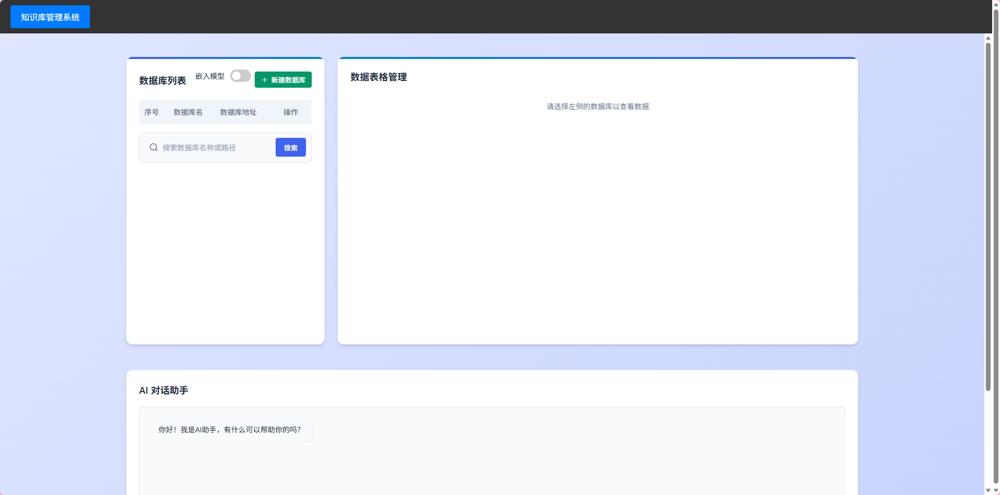

## python 安装 (个人版简易部署方案)

### 安装 KKSRAG

```bash
git clone https://github.com/xyp-carry/KKSRAG.git
cd KKSRAG
pip install -r requirements.txt
```

#### 运行
```python
python main.py
```

#### 结果
```python
INFO:     Started server process [xxxx]
INFO:     Waiting for application startup.
INFO:     Application startup complete.
INFO:     Uvicorn running on http://0.0.0.0:12250 (Press CTRL+C to quit)
```

#### 打开前端页面
```
cd server
python server.py
```

#### 结果演示

#### 模型参数配置

在/config/config.json中配置
```python
{
    "base_url": "https://open.bigmodel.cn/api/paas/v4/",
    "chatmodel":"glm-4.7"
    "api_key": "XXXXXXXXXXXXXXXXXXXXXXXXXXXXXXXXXX",
    "flash_base_url": "https://open.bigmodel.cn/api/paas/v4/", # 建议使用更小更快的模型
    "flash_api_key": "XXXXXXXXXXXXXXXXXXXXXXXXXXXXXXXXXX",
    "flash_model": "glm-4.7-flash"
    
}
```

### 安装 KKSwx
```python
安装了KKSRAG后，如若需要使用KKSwx对微信4.0进行操作时，需要安装KKSwx的依赖
cd KKSwx/installations
pip install -e .
```

#### KKSwx使用示例

```
# 示例
from KKShandler.KKSwx import KKSWx

KKSwx = KKSWx()


"""获取指定窗口的历史记录"""
hwnd = KKSwx.phandler.find_all_windows_by_keyword("robot_test")[0]['hwnd']
history = KKSwx.get_history(hwnd, roll_times=5)
print(history)


"""发送文本到指定窗口"""
KKSwx.send_text(hwnd, '你好')


"""监测指定窗口的新消息，键盘输入ctrl+alt+q退出"""
wxqueue = [[]]
"""
name : List[str]
answerlabel : str 根据标签表示是否让AI回答问题
only_monitor : bool 是否只监测窗口，不发送文本
"""
KKSwx.start(wxqueues= wxqueue,name=['robot_test'], answerlabel='@', only_monitor=True)

```

