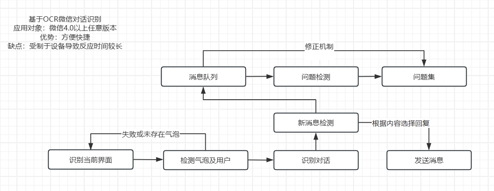

## 背景介绍
随着即时通讯工具的普及，群聊已成为信息交互的重要枢纽，但如何利用AI赋能群聊场景仍面临诸多技术挑战。当前，聊天数据的采集、实时更新与结构化处理缺乏统一且成熟的框架，这严重制约了智能群助手的落地应用。

针对上述痛点，本项目致力于构建一个能够无缝连接主流聊天软件的AI机器人系统，并提出了一套分层级的技术解决方案。

### 知识库构建
在系统架构上，我们不仅提供了一个轻量级的纯Python RAG系统以便于快速部署，同时支持无缝对接Dify或AutoRAG等成熟的第三方RAG框架，以满足更复杂、更高精度的业务需求。

### 信息采集工作
我们基于AI技术，设计了一个高效且闭环的问答采集系统，能够自动从群聊中提取有价值的问题和回答，同时支持手动添加和编辑。

### 跨平台接入与兼容性突破
针对聊天平台，我们利用图像识别技术能够接入微信4.0，实现将LLM接口接入聊天软件当中，后续我们还会基于wxauto等成熟框架完成对其他聊天软件的接入。

## 技术方案
### 基于OCR的微信聊天方案

1.界面元素检测与定位
系统首先利用训练好的 YOLOv13 目标检测模型对微信聊天界面进行扫描，对微信聊天界面进行解析，对气泡等元素进行定位。

2.文本区域识别与提取
在获取气泡定位后，系统裁剪出对应的图像区域，并调用 RapidOCR 进行文本提取。技术选型上，鉴于 RapidOCR 采用 DBNet 作为文本检测框架，该模型架构在处理高对比度、标准化的印刷体文本（即聊天软件界面字体）方面表现优异，craft可能会出现截断而截断处的文字无法被识别。

3.新对话动态检测
系统引入滑动窗口算法对连续识别出的文本流进行状态管理。算法通过维护一个动态窗口，持续比对历史窗口与当前窗口的数据差异，从而精准判定是否有“新对话”产生。仅在检测到新消息进入窗口时，系统才会触发后续的问答流程，避免了重复响应。

4.LLM 问答交互
当检测到有效的新对话后，系统将提取的用户提问信息通过 API 接口发送至大语言模型（LLM）。在此阶段，模型结合上下文理解用户意图，进行核心的推理与问答生成。

5.内容总结与质量评估
在生成初步回答后，系统进一步利用 AI 能力进行后处理。首先，对生成的答案进行精炼总结，对不太准确的知识库信息进行修正；其次，系统会根据整个聊天内容进行用户满意度的预估与评估。